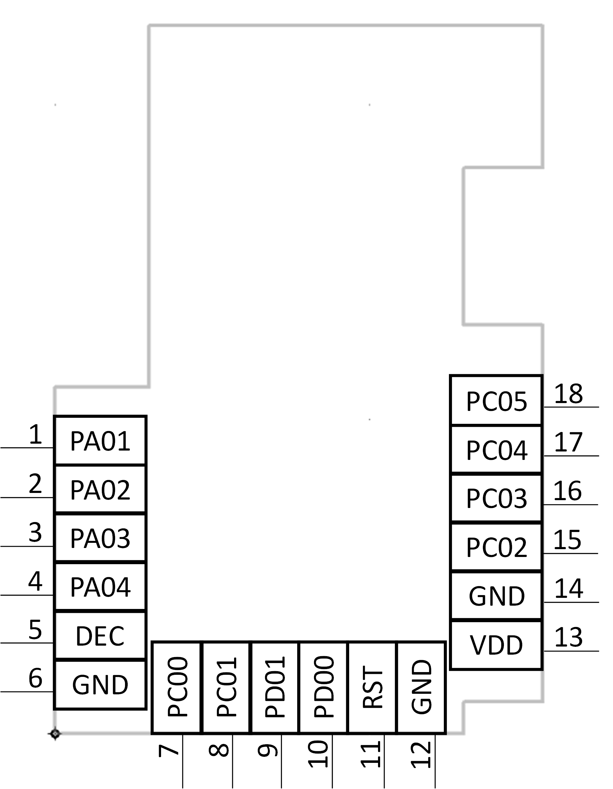

# <a>Hardware overview</a>
##About the chip
The chip used is a EFR32MGM21 from silabs, or more precisely MGM210L022JNF2, also called "Mighty Gecko Series 2".
Series 2 is important here as it introduces several important changes that will make most tools unusable unless they've been especially updated for them. Moreover using such tools can corrupt data since they may send wrong data on wrong addresses.

This chip is a 32 bit ARM Cortex M33 core that supports a maximum frequency of 80Mhz. It supports Zigbee, Thread and Bluetooth 5.0 wireless protocols

For more informations fou can see the [datasheet](https://www.silabs.com/documents/public/data-sheets/efr32mg21-datasheet.pdf) or the huge [reference manual](https://www.silabs.com/documents/public/reference-manuals/efr32xg21-rm.pdf)

## Pinout

Pin name| Pin # |Description|Pin Name| Pin # | Description
--:|:--:|:--|--:|:--:|:--|
PA01|1|PA01/SWCLK (Serial Wire Clock)| PD00|10|GPIO
PA02|2|PA02/SWDIO (Serial Wire Data I/O)|RESETn|11| Reset
PA03|3|PA03/SWV/TDO (Serial Wire Viewer)|GND|12|
PA04|4|PA04/TDI|VDD|13|VDD +3.3v
DEC|5|Decouple|GND|14|
GND|6||PC02|15|GPIO
PC00|7|PC00/PTI_SYNC (PTI Sync Out)|PC03|16|GPIO
PC01|8|PC01/PTI_DATA (PTI Data out)|PC04|17|GPIO
PD01|9|GPIO|PC05|18| GPIO

WARNING : The chip is designed to work with 3.3V, it won't tolerate 5.0V !

## Memory adress space

Before going further it is important to know how data is organized into memory. The datasheet explains it all that but we can sum things up as follows :

|Name |start address |end address | size | Access | Comments
|:--|:--|:--|:--|:--|:--|
|FLASH|0x0| 0x000FFFFF	| main firmware | unlocked| se table below for the detail of its subregions
|FLASH_USERDATA|	0x0FE00000|0x0FE003FF|0x400|locked - can be written by software using SE API| used in TRADFRI to set the device model
|FLASH_DEVINFO|0x0FE08000|0x0FE083FF|0x400|factory locked| contains informations about chip model
|FLASH_CHIPCONFIG|0x0FF0F000|0x0FE0E3FF| 0x400|locked|
|RESERVED|0x0FF00000|0x10000000||
|MUST CHECK|0x10000000|0x1FFFFFFF||
|RAM 0_RAM|0x20000000|0x20017FFF|	0x18000|unlocked|

##### Furthermore, the main FLASH is itself divided into several subregions :

|Name |start address |end address | size | Comments
|:--|:--|:--|:--|:--|
|Bootloader|0x0|0x3FFF|0x4000|handler hard lock error if missing
|Firmware application|0x4000|||external reset loop if missing
|unknowndata|0xF1800|||can be erased
|tables|0xF6000|||can be erased
somedata|0xF8000|||can be erased
somedata|0xFA000|||can be erased
somedata|0xFC000|||can be erased
Bootloader ?|0xFE270|||	external reset loop if missing

It is important to note that there are differences with ICC-1 and ICC-A-1 chips used in other TRADFRI accessories so don't apply blindly commands intended for those models, and don't use software that was not updated for "series 2". You take the (very likely) risk of erasing some data and soft bricking the chip or in very unlucky and rare cases you could even hard brick the chip.

# <a>Establishing communication</a>
To be able to communicate, you'll need to consider which hardware and which software you're going to use.
There are basically 2 families : J-link and non-J-link interfaces. The former is a professional and expensive interface that will have the advantage of being directly supported by the official Silabs tools with advanced features at high speeds.
If you are the lucky owner of a Jlink interface you can use Silab's Simplicity Commander which will allow to do all required operations for reading, flashing and setting up the MCU.
It's available for [Windows](https://www.silabs.com/documents/public/software/SimplicityCommander-Windows.zip), [macOS](https://www.silabs.com/documents/public/software/SimplicityCommander-Mac.zip) and [Linux](https://www.silabs.com/documents/public/software/SimplicityCommander-Linux.zip)

Other interfaces will require setting up a 3rd party software called [OpenOCD](https://openocd.org) that will require more steps.
Communication speed will vary depending on the hardware but should be faster with J-link.
All in all, other interfaces will still largely allow us to do what we need.

## Wiring the debug connection

There are 2 kinds of connections you can setup : JTAG or SWD.
Both methods allow similar things, but SWD has the advantage of being simpler as it only requires 2 wires.
It's worth noting that the pins used by SWD pins are common with JTAG ones (except for FT232), meaning a JTAG wiring will also be SWD capable with no modification.
There are many different hardware interfaces that you can use. Again, there are J-link compatible ones, and others. While J-Link is basically compatible with all the tools, other interfaces will only be compatible with OpenOCD.
Below is a non exhaustive list of various common interfaces you can use, several guides detail OpenOCD configuration. Unless you're using a J-link compatible interface, you'll want to check the next section about OpenOCD installation before digging into the details of the guides below.

* [**j-link**](https://www.segger.com/products/debug-probes/j-link/models/j-link-base/): preferred method as it's natively compatible with the official tools from Silabs, but expensive.

* [**j-link clone**](https://www.segger.com/products/debug-probes/j-link/models/other-j-links/st-link-on-board/): cheap and might work as good as the real one if it's well designed, but please support original maker whenever possible.

* [**j-link-OB**](https://www.segger.com/products/debug-probes/j-link/models/j-link-ob/ ): supposed to be integrated by some manufacturers in evaluation boards, but some say you can find standalone clones…

* **Raspberry Pi**: you can use its GPIOs, following this [guide](https://learn.adafruit.com/programming-microcontrollers-using-openocd-on-raspberry-pi) or [this one](https://www.pcbway.com/blog/technology/OpenOCD_on_Raspberry_Pi__Better_with_SWD_on_SPI.html) if you want to try SPI for a more accurate clocking

* **Arduino micro** : you can turn the atmega32u4 into a tiny practical and inexpensive CMSIS-DAP interface, find the sketch [here](https://github.com/myelin/arduino-cmsis-dap), instructions and pinout are in the sketch

* **ESP8266**: this one can debug wirelessly using a fork of Black Magic Probe firmware, find instructions and resources [here](https://github.com/walmis/blackmagic-espidf.git), prebuilt binaries are also available [here](https://github.com/J-Wrobel/blackmagic-espidf/tree/master/bins)

* **FT232**: Faster than others non J-link interfaces, find a guide [here](https://www.allaboutcircuits.com/technical-articles/getting-started-with-openocd-using-ft2232h-adapter-for-swd-debugging/). OpenOCD already has the configuration for FT232R but you'll need to add [this configuration file](https://github.com/unprovable/FTDI-Oh-My/blob/master/FT232H-openOCD.cfg) if you have FT232H.

Keep in mind that despite what you could see sometimes, wiring Reset is not required, SWD and JTAG should work fine without it, however your mileage may vary depending on the hardware and OpenOCD configuration.

Below are different examples of wirings :

|EFR32	|SWD|JTAG|Raspberry Pi (2+)|Arduino Micro|ESP8266|FT232 SWD|FT232 JTAG
|:-:|:-:|:-:|:-:|:-:|:-:|:-:|:-:|
|PA01|SWCLK|TCK	|25	|3|D4|AD0|AD0|
|PA02|SWDIO|TMS	|24	|2|D3|(AD1+resistor)+AD2|AD3
|PA03||TDO|	22	|4|D5||AD2
|PA04||TDI|	23	|5|D7||AD1||TDI|
|RST|RST|RST|	18	|6|D6|AD5|AD5

This table is based on the various configurations used in the resources linked here. It can be different with other configurations.
Please note that on FT232 pins are not common between SWD and JTAG, meaning you can't have both connection with the same layout. Also, SWD with FT232 will require to put a resistor from 220 to 470 Ohms on AD1.
