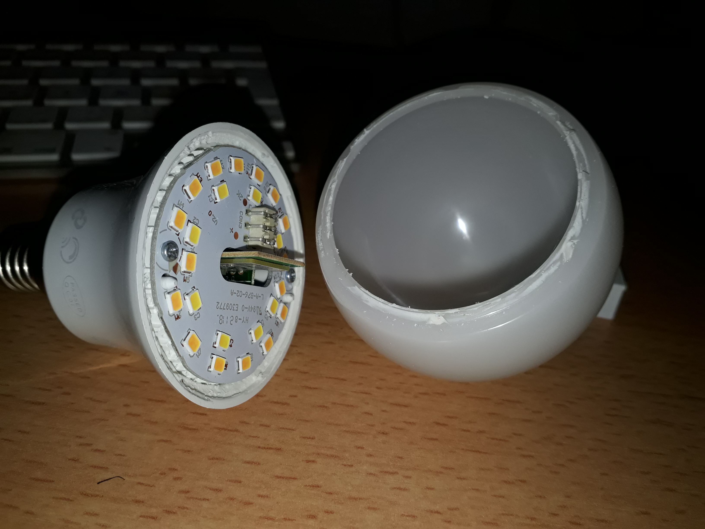
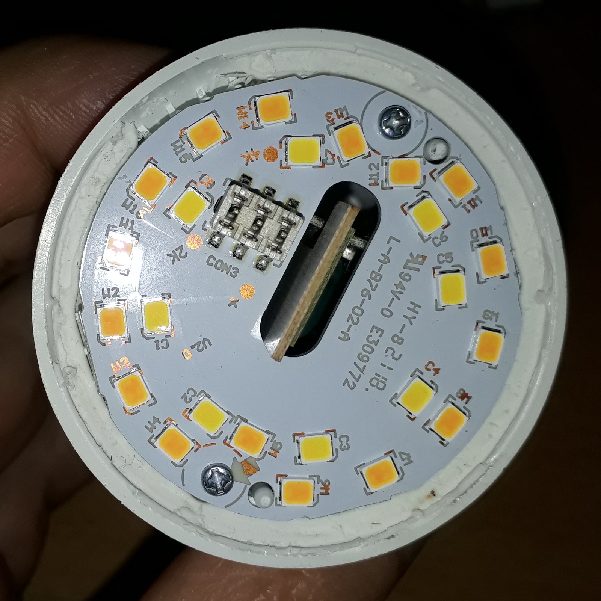
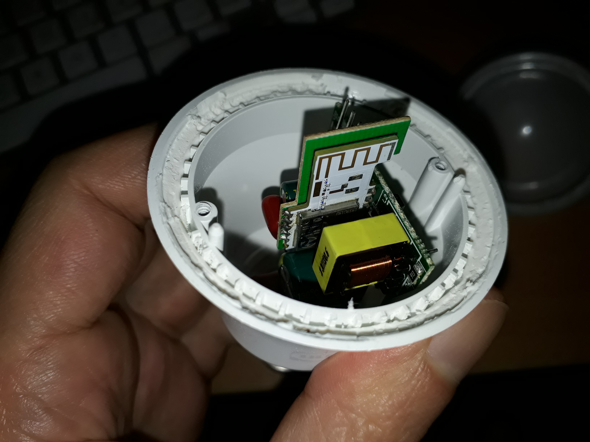
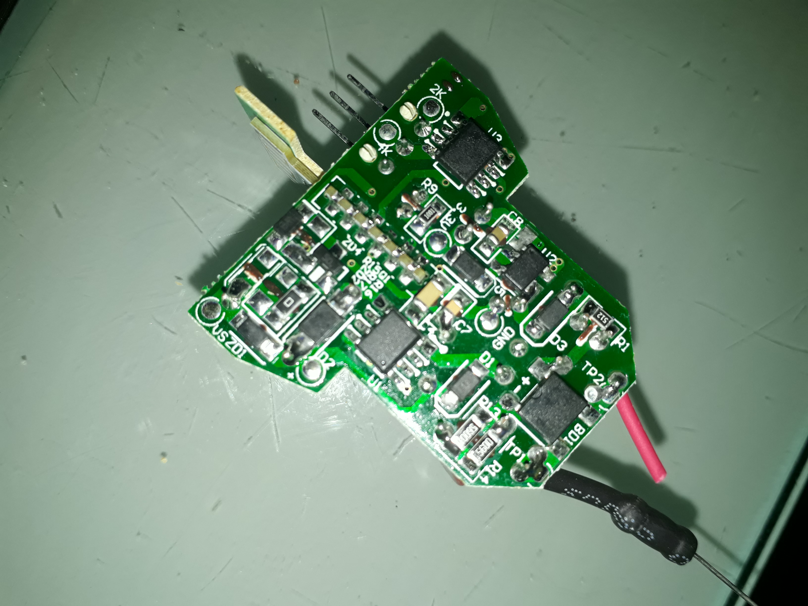
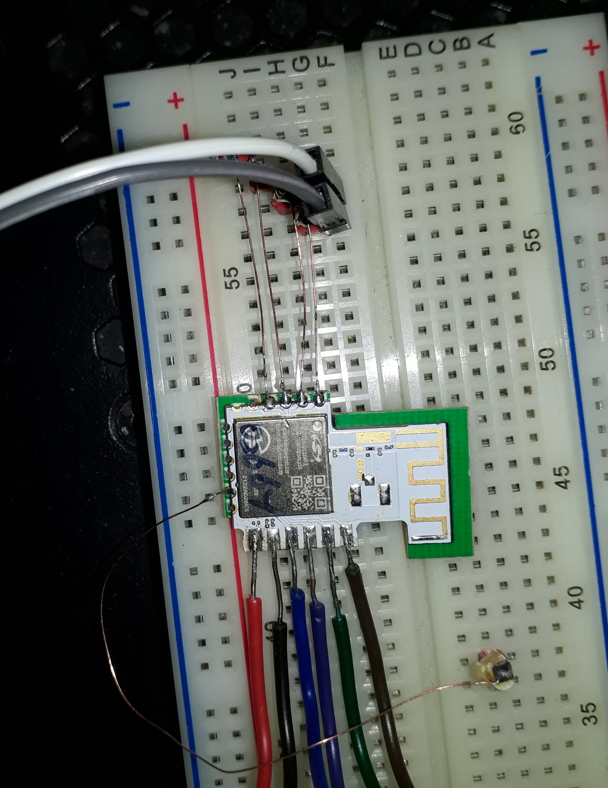

# <a>Teardown and reassembly guide</a>

# Teardown
The lightbulbs are rather easy to take apart, you can open them in a few minutes without breaking anything.
If done gently, you’ll even be able to reassemble them without anyone being able to notice.
This stands for the “classic” bulbs, as GU10 ones or less common shapes might be more difficult to open.

  

That might seem obvious but the lightbulb is designed to run with high power, largely enough to kill you. Before doing anything, disconnect the lightbulb from current source, and stay away from it while tinkering.

## 1 - Remove the bulb

The bulb is glued to the plastic body with some not so strong and gummy glue.
Use something like a butter knife, you don’t need something especially thin, avoid blades and knifes with teeth for both your security and to not scratch the parts.
Take the bulb horizontally and push the knife in the notch between the bulb and the body at a 90° angle.
Don’t try to go under the plastic yet, this might not be needed.
Rotate holding the bulb, holding the knife this way so you cut the glue all around.
Once done try to lift firmly the bulb from the base. The bulb doesn’t seem to be made of glass and is tolerant to some torsion, but don’t be too strong so it doesn’t explode inside your hand.
If it’s not enough, try to pry gently under the plastic body all around the bulb, you don’t have to go deep, it only  goes about 2mm under.
After that, the bulb should definitely come with no difficulty, and still no damage.

## 2 - Remove the plate

You can now see the plate holding the LEDs and the antenna of the zigbee module passing through a hole.
Remove the 2 phillips screws and unplug the plate by lifting evenly all around to not bend the plate or the pins.

## 3a - Remove the Zigbee module - Methode 1

Now you can see the inside electronics and the zigbee module which is fitted perpendicularly in a notch on the main PCB.

Here comes the chirurgical part.
Using a soldering iron, you should have enough room in the body to unsolder the zigbee module from the other side of the PCB, where the module goes past the surface about 1 or 2mm.
As there are numerous contacts on both sides, you’ll have to be precise and patient.
I took the bulb in my left hand, putting my index on the back of the zigbee module and applying a soft but constant pressure, to lift the module off the notch.
With the right hand, drag the tip of the soldering iron along the tiny angle formed by the 2 PCBs crossing each other (see picture 3b below).
Go slow enough so the solder has time to melt, and fast enough so you can reach the other end while it is still fluid. Putting some more tin may help, it will communicate heat better and will take longer to get hard. The contacts on the 2 sides are for the same tracks so you should not need to do it on both sides as heat will communicate from one side to the other. However if it was not the case don’t hesitate to alternate on both sides.
Drag like this several times, with your constant pressure, it will slowly progress out of the notch.
The notch is quite tight and adjusted, tilting the module may get it stuck, so take care to keep it in a straight position. When one side comes out more than the other, progress on the opposite side, and so on…
If you’re good at it, it should not take long.

## 3b - Remove the Zigbee module - Methode 2 (possibly destructive)

If you’re not comfortable/patient enough for the above methode, you can still remove the metallic screw on the bottom by unscrewing it from the plastic base. It is stamped at its top so it might be a bit difficult and damage the plastic.

## 4 - Wire the connections you need

Once you have your module, you can put it on a breadboard or whatever you want. Except for the right side, the pads around are really tiny, I used single strands of a multi strand wire to have wires tiny and flexible enough.
On the picture you can see the 4 top pads required for JTAG and SWO wired using strands of a bigger wire. The single wired pad on the left is the reset, and the 6 bigger pads on the bottom are +3,3V, GND and 4 GPIOs.

# Reassembly
Now that your light bulb has been taken into parts you have earned an EFR32, an adjustable AC/DC converter (power and voltage yet to be measured) and the plastic bulb, which is a quite nice light diffuser. If you want to get a working light bulb back, you have 2 possiblities :
* You can keep the EFR32, and repurpose your ex-connected light bulb as a "dumb bulb".

* You can put everything back together and get the bulb back to its original state

  

As a second reminder, you're going to deal with a PCB that is designed to run with 230V or around, depending on your country. When you are going to put power back in the bulb, short circuits, wrong wirings or leftovers of conductive material might be dangerous. It can blow fuses, explode, burn, damage your electrical installation…
So I encourage you to take all measures to not expose yourself, verify thoroughly your job before using the bulb again, and be prepared to react quickly and accordingly if something goes wrong. 

## 5a - Repurpose the bulb as a classic "dumb bulb"

It is still possible to get the light bulb working without the EFR32. You'll obviously lose all the connected features, but can still adjust manually the power, temperature or color if that's applicable to your model.
The basic working it that the EFR32 provides PWM levels between 0 and 3,3v on pins PC02, PC03, PC04 and PC05 to adjust those parameters. In our case, for the LED2002G5 which only has power and temperature, pin PC02 gives the power level and PC03 gives the temperature.
It is thus possible to simulate full power level by shorting +3,3V and PC02 pads on the PCB (around the notch that holds the EFR32).
The same can be achieved for temperature by shorting +3,3v and PC03.

## 5b - Full reassembly of the light bulb.

If you're done with all this and want to recover your fully functional lightbulb, it is quite easy to get it back to its original state.
You'll basically have to just put the EFR32 back in its notch, re-solder it and put the bulb back.
The only tricky part is that after you've played around with the EFR32, it's likely you've put some solder on its pads, making it slightly thicker.
As the notch where it's to be inserted is really tight, it might not fit anymore.
You'll have to remove as much solder as possible using something like a pump, or some tress.
You can push a little if you feel some light resistance, but if it doesn't fit reasonably easily, keep removing the solder.
Don't put too much effort, otherwise the tracks will be easily torn away.

Once the EFR32 is back in place, drag your soldering iron along the pads. With a bit of luck, the remaining solder might be sufficient and adding some  might not be required, otherwise just do.
Verify cautiously that you didn't do unwanted short circuits between some pads.

After that, you can just clip the bulb back, this might require to clean the remains of glue so it does fit nicely into its place. You shouldn't need to put glue unless you want it to be strongly fixed.
